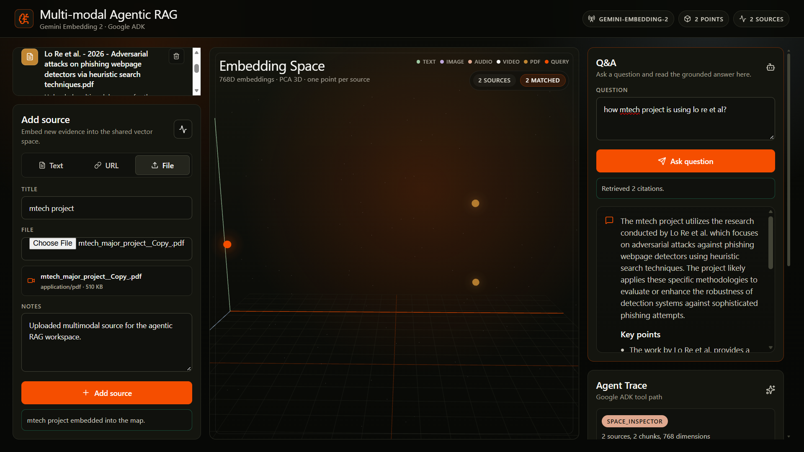

# Multimodal Agentic RAG

This is end-to-end RAG platform that uses autonomous agent to query across text, images, and documents in a unified vector space.

Instead of relying on heavy third-party vector databases like Pinecone or Chroma, I engineered a custom, lightweight in-memory vector store using NumPy to deeply understand multimodal embedding math, cosine similarity, and real-time dimensionality reduction.

## Core Highlights

- **Agentic Routing:** Uses Google ADK to power an autonomous reasoning loop. The agent decides when to retrieve data, how to synthesize it, and bypasses redundant vector searches when it already knows the answer.

- **Multimodality:** Powered by Gemini Embedding 2. Text queries, PDFs, and uploaded images are projected into the exact same 768-dimensional space, allowing cross-modal retrieval without complex translation layers.

- **Math from Scratch:** Implemented manual cosine similarity for search and Principal Component Analysis (PCA) via Gram-Schmidt orthogonalization to project 768D vectors down to 3D.

- **Interactive 3D UI:** A React/Vite frontend that visualizes the vector space in real-time, allowing users to literally see how close their query lands to the source documents. Each source appears as one point. When you ask a question, the query is projected into the same space and the cited sources are highlighted.



## Architecture

| Layer | Role |
| --- | --- |
| React + Vite frontend | Source manager, Q&A panel, citations, trace, and 3D embedding view |
| FastAPI backend | Ingestion, retrieval, answer API, and embedding-space snapshots |
| `MultimodalRagStore` | In-memory source metadata, chunks, embeddings, search, and PCA projection |
| Gemini Embedding 2 | Source and query embeddings across supported modalities |
| Google ADK agent | Answer coordinator that receives the same retrieval packet shown in the UI |

The important implementation detail is that `/ask` performs retrieval once and passes that same retrieval packet into the ADK answer flow. The answer and the citation panel are therefore based on the same ranked evidence.

## Project Structure

```text
rag_tutorials/multimodal_agentic_rag/
|-- README.md
|-- assets/
|   `-- multimodal-agentic-rag-architecture.png
|-- backend/
|   |-- app_state.py
|   |-- rag_store.py
|   |-- requirements.txt
|   |-- server.py
|   `-- agentic_rag_agent/
|       |-- __init__.py
|       `-- agent.py
`-- frontend/
    |-- index.html
    |-- package.json
    |-- src/
    |   |-- App.tsx
    |   |-- main.tsx
    |   `-- styles.css
    |-- tsconfig.json
    `-- vite.config.ts
```

## Run Locally

Start the backend:

```bash
cd backend
python3 -m venv .venv
source .venv/bin/activate
pip install -r requirements.txt
export GOOGLE_API_KEY="your-google-ai-studio-key"
python server.py
```

The backend runs at:

```text
http://localhost:8897
```

Start the frontend in another terminal:

```bash
cd frontend
npm install
npm run dev -- --port 5177
```

The frontend runs at:

```text
http://localhost:5177
```

If the backend is on a different port:

```bash
VITE_API_URL=http://localhost:8897 npm run dev -- --port 5177
```

## Try It

1. Open `http://localhost:5177`.
2. Add a text, URL, PDF, image, audio, or video source.
3. Ask a question in the Q&A panel.
4. Review the answer and citations.
5. Inspect the source and query points in the embedding view.

## Tech Stack

- Frontend: React, Vite, Tailwind CSS, Three.js (for 3D vector visualization)

- Backend: Python, FastAPI, NumPy, Google GenAI SDK

- AI/Agent: Google Api key, Google Agent Development Kit (ADK)